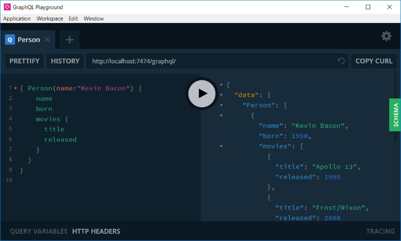

# neo4j-decorator

[](https://hub.docker.com/r/awesomeinc/neo4j-decorator/builds/)
[](https://travis-ci.org/awesome-inc/neo4j-decorator/)
[](https://travis-ci.org/awesome-inc/neo4j-decorator/)
[](https://travis-ci.org/awesome-inc/neo4j-decorator/)

[](https://travis-ci.org/awesome-inc/neo4j-decorator/)
[](https://github.com/awesome-inc/neo4j-decorator)
[](https://github.com/awesome-inc/neo4j-decorator)

A decorator for the Neo4j REST Api.

## Using the docker image

```bash
docker run awesomeinc/neo4j-decorator
```

Mount your configuration into the container, e.g. in your `docker-compose.yml`.

```yml
    volumes:
       - "./decorator/config/:/etc/decorator/config
```

## Configuration

The motivation is to decorate some new links (or actions) into nodes & edges (HATEOAS Style).
The default `config.yml` looks something like this

```yml
server_url: 'http://localhost:3000/graph'
neo4j_url: 'http://localhost:7474/db/data'
decorate:
  _all:
  _node:
    data:
      links:
        - title: Expand...
          href: '{{config.server_url}}/cypher'
          method: 'POST'
          body:
            query: 'MATCH (u)-[e]-(v) WHERE ID(u)={{doc.metadata.id}} RETURN u,e,v'
  _edge:
    data:
      links:
        - title: Expand...
          href: '{{config.server_url}}/cypher'
          method: 'POST'
          body:
            query: 'MATCH (u)-[e]-(v) WHERE ID(e)={{doc.metadata.id}} RETURN u,e,v'
  SomeNodeLabel:
    ...
  SOME_EDGE_TYPE:
    ...
decorate_transactional:
```

This decorates a default action _Expand..._ to all nodes and edges.

Place additional configuration extensions (yml) as drop-ins into `/etc/decorator/conf.d` (see [test/config](./test/config)).

### Templating

Templating is based on [Nunjucks](https://mozilla.github.io/nunjucks/) so can use any [Builtin Filters](https://mozilla.github.io/nunjucks/templating.html#builtin-filters).

The template context is

```javascript
const context = {
  config: config,
  doc: doc,
  env: process.env
};
```

where

- `config` is the `config.yml`. You may put any variables/constants here just like `server_url` or `neo4j_url`
- `doc` is the current document (node or edge)
- `env` is the process environment (on the server).

#### Special Case

All top-level keys from the `config.yml` that end in `_url` can also be interpolated.

## Docs

It is possible to make custom data available via `/docs/:key`. For instance, have a yml-file `/etc/decorator/docs.d/my-config.yml` with

```yml
---
myconfig:
  myvalue1: foo
```

This can be fetched using `GET /docs/myconfig` returning

```json
{
  "myvalue1": "foo"
}
```

## Examples

### Cypher

An example request to the decorator

```json
POST http://localhost:3000/graph/cypher
{
  "query": "MATCH (u)-[e]->(v) RETURN u, e, v LIMIT 25"
}
```

### APOC & Transaction Endpoint

Here is an example config-snippet for the transactional endpoint that works for the APOC beginners example [Calling Procedures within Cypher](https://neo4j-contrib.github.io/neo4j-apoc-procedures/#_calling_procedures_within_cypher):

```yml
    decorate_transactional:
      Person:
        properties:
          links:
            - title: "Google '{{doc.properties.name}}'"
              href: 'https://www.google.de/search?q={{doc.properties.name}}'
```

Here's the example request:

```json
POST http://localhost:3000/graph/transaction/commit
{
  "statements" : [
    {
      "statement" : "WITH 'https://raw.githubusercontent.com/neo4j-contrib/neo4j-apoc-procedures/3.2/src/test/resources/person.json' AS url\nCALL apoc.load.json(url) YIELD value as person\nMERGE (p:Person {name:person.name})\nON CREATE SET p.age = person.age, p.children = size(person.children)\nRETURN p",
        "resultDataContents" : ["row", "graph"]
    }
  ]
}
```

## Neo4j and GraphQL

This repository contains a standard neo4j community service, customized with the following plugins

- [APOC](https://github.com/neo4j-contrib/neo4j-apoc-procedures)
- [GraphQL](https://github.com/neo4j-graphql/neo4j-graphql) plugins

To get a feel on GraphQL with neo4j, first hit the neo4 browser at
[http://localhost:7474](http://localhost:7474) and create some sample data

```cypher
:play movie-graph
```

Next add a sample GraphQL schema (cf.: [Uploading a GraphQL Schema](https://github.com/neo4j-graphql/neo4j-graphql#uploading-a-graphql-schema))

```cypher
CALL graphql.idl('
type Movie  {
  title: String!
  released: Int
  actors: [Person] @relation(name:"ACTED_IN",direction:IN)
}
type Person {
  name: String!
  born: Int
  movies: [Movie] @relation(name:"ACTED_IN")
}
')
```

Finally try an example graphql query

```graphiql
{ Person(name:"Kevin Bacon") {
    name
    born
    movies {
      title
      released
    }
  }
}
```

Here is a screenshot using the [GraphQL Plaground](https://github.com/prisma/graphql-playground).


